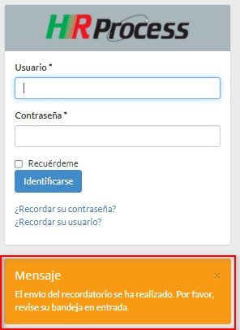
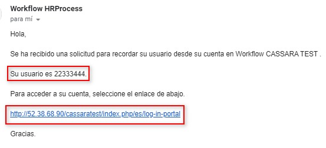
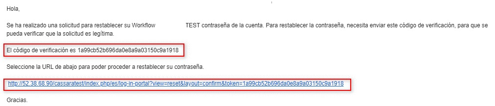
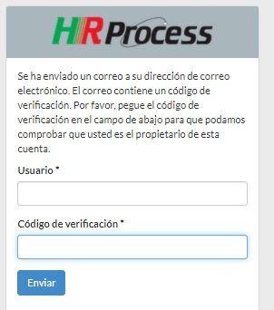
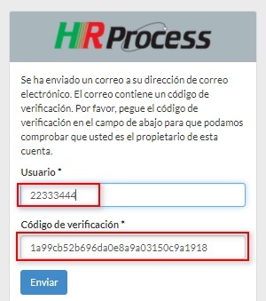
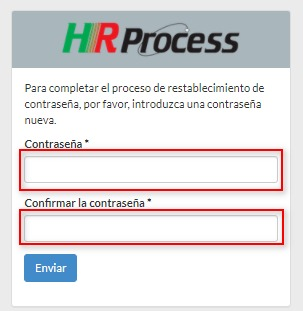
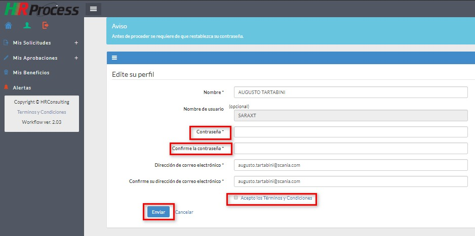
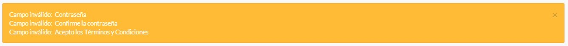
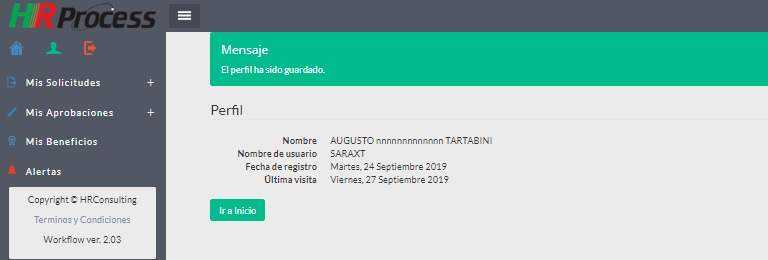
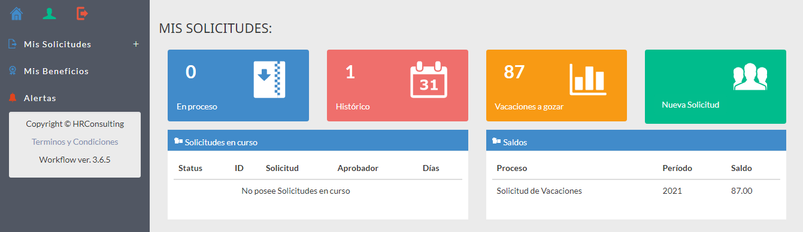

**Importante**: El sistema puede tener evoluciones, instalación parcial
de módulos, motivo por el cual las imágenes y/o descripciones del
presente manual pueden ser diferentes.

**Primeros pasos**
==================

**Ingreso al sistema**
----------------------

Esta pantalla será la que visualizará al ingresar al sistema.

.. figure:: image/loginC.png#only-light
   :alt: Texto alternativo

   Texto alternativo

Aquí el usuario deberá completar el “**usuario**” y la “**contraseña**”
que le hayan asignado inicialmente y dar “**Clic**” en el botón
“**Identificarse**”.

--------------

**Colaborador olvidó el Usuario**
---------------------------------

.. figure:: image/login1C.png#only-light
   :alt: Texto alternativo

   Texto alternativo

Al visualizar la pantalla de Ingreso al Sistema deberá dar “**Clic**” en
recordar su usuario, le solicitará su mail cargado en el sistema en una
pantalla como la siguiente.

.. figure:: image/recuserC.png#only-light
   :alt: Texto alternativo

   Texto alternativo

Luego de introducir su correo, deberá dar “**Clic**” en “**Enviar**” le
devolverá la siguiente pantalla, donde le indica que le enviará un mail
con su usuario:

   Texto alternativo

Recibirá el siguiente mail en su Bandeja de entrada, donde le indica su
usuario y un link para ingresar al sistema:

   Texto alternativo

--------------

**Colaborador olvidó la clave**
-------------------------------

.. figure:: image/recpassC.png#only-light
   :alt: Texto alternativo

   Texto alternativo

Al visualizar la pantalla de Ingreso al Sistema deberá dar “**Clic**” en
recordar su contraseña, le solicitará su **mail** cargado en el sistema
en una pantalla como la siguiente:

.. figure:: image/recpass1C.png#only-light
   :alt: Texto alternativo

   Texto alternativo

Recibirá la siguiente pantalla, donde le indica que **le será enviado un
mail** con su código de verificación y le deja una pantalla como la
siguiente para introducirlo:

   Texto alternativo

   Texto alternativo

En este mail tiene el código de verificación que lo puede copiar y pegar
en la ventana anterior o directamente dar “**Clic**” en el link y le
abrirá la ventana con el código de verificación insertado, ahí deberá
completar su usuario y dar “**Clic**” en “**Enviar**”.

   Texto alternativo

Visualizará la siguiente pantalla, donde le solicitará una nueva
contraseña y la verificación de la misma:

   Texto alternativo

Luego de enviarla se desplegará la pantalla del sistema para ingresar
con su usuario y nueva contraseña.

--------------

**Primer ingreso al sistema**
-----------------------------

En el **primer ingreso al sistema** se desplegará la siguiente pantalla:

   Texto alternativo

Deberá completar los campos:

-  **Contraseña**
-  **Confirme la contraseña**
-  Dar “**Clic**” sobre el párrafo “**Acepto los Términos y
   Condiciones**” después de leerlos.
-  Dar “**Clic**” en el casillero a la izquierda del párrafo “**Acepto
   los Términos y Condiciones**” para que se marque la tilde.
-  Dar “**Clic**” en el botón “**Enviar**” y recordar la contraseña
   registrada.

En el **caso de no completar correctamente** los campos solicitados el
sistema le devolverá un mensaje indicando los errores , por ejemplo:

   Texto alternativo

Una vez completada la información correctamente el sistema le devolverá
la siguiente pantalla:

   Texto alternativo

En ella deberá dar “**Clic**” sobre el botón “**Ir a Inicio**” y podrá
comenzar a navegar por el sistema, con las funciones habilitadas a su
perfil. A partir de estas validaciones la pantalla que se desplegará al
ingresar al sistema es la siguiente:

   Texto alternativo

Sobre la izquierda de la pantalla están las funciones que se pueden
realizar.

**Mis datos (Datos personales)**
--------------------------------

   Texto alternativo

Con esta función se pueden **actualizar los datos personales**, para
ello existen 2 solapas que se detallan brevemente a continuación:

**General**
~~~~~~~~~~~

.. figure:: image/generalC.png#only-light
   :alt: Texto alternativo

   Texto alternativo

Adicionalmente, desde esta solapa se puede **cambiar la contraseña**, si
fuera necesario.

**Organización**
~~~~~~~~~~~~~~~~

.. figure:: image/orgC.png#only-light
   :alt: Texto alternativo

   Texto alternativo

En todas las solapas, al finalizar los cambios deberá dar “**Clic**”
sobre el botón “**Guardar cambios**” si desea que los mismos sean
conservados, en el caso de no realizar cambios o no querer conservarlos
dar “**Clic**” sobre el botón “**Volver**”.

*La pantalla de Organización es solamente informativa.*
